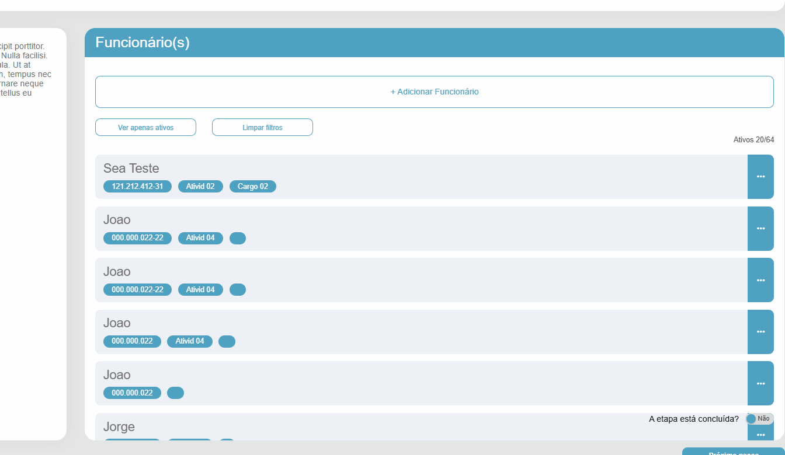
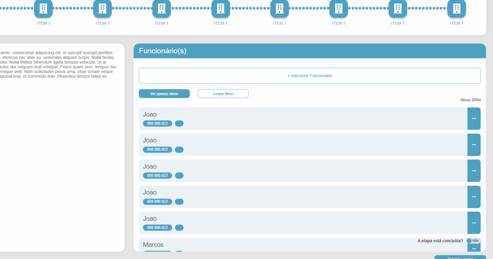

#  Relatório de Bugs e Melhorias
**Projeto:** Desafio QA - SEA Tecnologia  
**Data:** 19/11/2025  
**Analista:** [Vinicios Ferreira]  
**Ambiente de Teste:** Google Chrome (Versão 131) | Windows 11

---

## 🔴 Bugs Críticos e de Alta Prioridade

### [BUG-001] Falha na Validação do Campo CPF/RG
* **Severidade:** Alta
* **Prioridade:** Alta
* **Descrição:** O campo CPF aceita inserção de caracteres alfanuméricos e caracteres especiais, não aplicando máscara ou validação de formato.
* **Passos para reproduzir:**
  1. Acessar a tela "Adicionar Funcionário".
  2. No campo CPF, inserir letras ou símbolos (ex: "123.abc.!!!").
  3. Clicar em outro campo para tirar o foco.
* **Resultado Atual:** O sistema aceita o valor inválido sem exibir mensagem de erro.
* **Resultado Esperado:** O campo deve aceitar apenas números e aplicar a máscara padrão (000.000.000-00).
* **Evidência:**

---

### [BUG-002] Perda de Dados ao Adicionar Outra Atividade (EPI)
* **Severidade:** Alta ([Crítica])
* **Prioridade:** Alta
* **Descrição:** Ao tentar adicionar uma segunda atividade no fluxo de EPIs, o sistema redireciona o usuário para o menu inicial, descartando todos os dados preenchidos no formulário anterior.
* **Passos para reproduzir:**
  1. Preencher o formulário de dados pessoais.
  2. Preencher os campos de atividade, EPI e CA.
  3. Clicar no botão "Adicionar outra atividade".
* **Resultado Atual:** O usuário é redirecionado para a home e o formulário é resetado.
* **Resultado Esperado:** O sistema deve salvar a atividade atual na lista temporária e limpar os campos de EPI para nova inserção, mantendo os dados pessoais preenchidos.
* **Evidência:**

---

### [BUG-003] Botão "Adicionar EPI" Inoperante
* **Severidade:** Alta
* **Prioridade:** Média
* **Descrição:** O botão para incluir um EPI na lista não executa nenhuma ação ao ser clicado.
* **Passos para reproduzir:**
  1. Manter o checkbox "O trabalhador não usa EPI" desmarcado.
  2. Selecionar uma Atividade e um EPI.
  3. Inserir um CA válido.
  4. Clicar em "Adicionar EPI".
* **Resultado Atual:** Nenhuma ação ocorre (o EPI não é listado).
* **Resultado Esperado:** O EPI deve ser adicionado a uma lista visual abaixo do formulário.
* **Evidência:**

---

### [BUG-004] Botão "Opções" (Alterar/Excluir) não responde
* **Severidade:** Alta
* **Prioridade:** Alta
* **Descrição:** O botão de reticências (...) na lista de funcionários não abre o menu de contexto, impedindo a edição ou exclusão de registros.
* **Passos para reproduzir:**
  1. Visualizar a lista de funcionários cadastrados.
  2. Clicar no ícone de opções (...) de qualquer funcionário.
* **Resultado Atual:** O menu não abre.
* **Resultado Esperado:** Deve abrir um submenu com as opções "Alterar" e "Excluir".
* **Evidência:**

---

### [BUG-005] Bloqueio de Navegação ("Próximo Passo")
* **Severidade:** Alta
* **Prioridade:** Alta
* **Descrição:** Mesmo marcando a etapa como concluída, o fluxo de navegação para a próxima fase do onboarding não é habilitado.
* **Passos para reproduzir:**
  1. No rodapé da página, marcar o rádio "Sim" para "Etapa está concluída?".
  2. Tentar clicar no botão "Próximo Passo".
* **Resultado Atual:** O botão permanece desabilitado ou inoperante.
* **Resultado Esperado:** O botão deve habilitar e levar o usuário para a próxima etapa da barra de progresso superior.
* **Evidência:**

---

### [BUG-006] Inconsistência de Formatação no CPF (Ativo vs Inativo)
* **Severidade:** Média
* **Prioridade:** Média
* **Descrição:** Existe uma discrepância na formatação visual do CPF na listagem dependendo do status do funcionário.
* **Passos para reproduzir:**
  1. Cadastrar um funcionário INATIVO (CPF aparece formatado: 222.222.222-22).
  2. Cadastrar um funcionário ATIVO.
* **Resultado Atual:** O CPF do funcionário ativo aparece sem pontuação correta (ex: "000.000.000" ou sem traço).
* **Resultado Esperado:** O CPF deve seguir a máscara padrão independente do status do usuário.
* **Evidência:**

---

### [BUG-007] Falta de Scroll na Listagem de Funcionários (UI)
* **Severidade:** Média
* **Prioridade:** Média
* **Descrição:** A interface não apresenta barra de rolagem (scroll) vertical quando a quantidade de funcionários excede o tamanho da tela.
* **Passos para reproduzir:**
  1. Cadastrar múltiplos funcionários (mais de 5 ou 6).
* **Resultado Atual:** Os últimos funcionários da lista ficam ocultos e inacessíveis.
* **Resultado Esperado:** O container da lista deve ter propriedade de scroll (`overflow-y: auto`) ou a página deve permitir rolagem.
* **Evidência:**

---
### [BUG-008] Falha Crítica na Responsividade e Cross-Browser (UI Quebrada)

* **Severidade:** Alta
* **Prioridade:** Alta
* **Descrição:** Em várias resoluções de desktop (ao redimensionar a janela) e em dispositivos móveis (testado em iPhone XR e S24), o layout da aplicação quebra. Elementos se sobrepõem, textos são cortados, e a usabilidade se torna impossível no mobile.
* **Passos para reproduzir (Mobile):**
  1. Acessar a aplicação em um dispositivo móvel (ou simular a resolução de celular no Chrome DevTools).
  2. Navegar para a tela de Cadastro de Funcionário.
* **Resultado Atual:** Elementos não respeitam a hierarquia e o *viewport*, resultando em sobreposição total e impossibilidade de interagir.
* **Resultado Esperado:** O layout deve se adaptar ao tamanho da tela (ser *responsivo*), organizando os elementos verticalmente em telas menores.
* **Evidência:**

  * **Versões Web:**

  

  * **Versões Mobile:**
  
  

## 🟡 Melhorias e Validações (Sugestões)

### [MEL-001] Validação de Datas Reais
* **Severidade:** Média
* **Ocorrência:** O campo data aceita anos irreais (ex: ano 0001 ou 3000).
* **Sugestão:** Implementar validação para impedir datas de nascimento futuras ou muito antigas.

### [MEL-002] Segurança no Upload de Arquivos
* **Severidade:** Baixa (Risco de Segurança)
* **Ocorrência:** O upload de Atestado aceita qualquer extensão (.exe, .bat, etc).
* **Sugestão:** Restringir tipos de arquivos para `.pdf`, `.jpg`, `.png` e limitar o tamanho máximo (ex: 5MB).